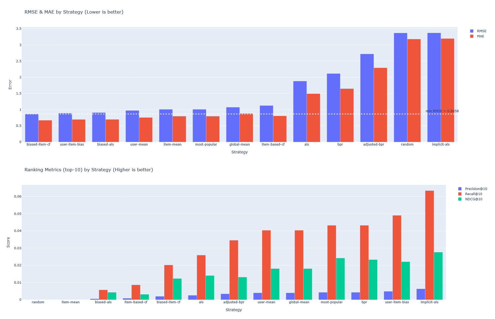

# Hackneyed Recommender

A Collaborative Filtering (CF) playground comparing 13 recommendation strategies on MovieLens, with a web UI for model fitting and live recommendations. 



## What is this? 
I had never implemented a recommendation system. I set about putting together a small project to review the basic tenets and learn about Collaborative Filtering. Somewhere along the way, that turned into a comparative analysis of assorted recommendation strategies on the MovieLens dataset, as well as an accompanying web UI. There, you can fit models with custom hyperparameters, run a live recommendation demo, and review a result dashboard comparing some specific recommendation setups. 

## Recommendation Strategies 
This table depicts all 13 Recommendation Strategies available. An indication is made if the strategy is capable of predicting user ratings along with recommending films. 

| Strategy | Predict | File |
|-----------|---------|------|
| Global Mean | + | `baselines.py` |
| User Mean | + | `baselines.py` |
| Item Mean | + | `baselines.py` | 
| User Item Bias | + | `baselines.py` |
| Most Popular | + | `baselines.py` |
| Random | + | `baselines.py` |
| Item-Based CF using Cosine Similarity  | + | `itembasedcf.py` |
| Biased Item-Based CF using Baseline-Corrected Residuals | + | `biaseditembasedcf.py` |
| Matrix Factorization using Alternating Least Squares (ALS) | + | `alsfactorization.py` |
| Matrix Factorization using ALS+Baseline-Corrected Residuals | + | `biasedalsfactorization.py` |
| Matrix Factorization using Implicit ALS | - | `implicitalsfactorization.py` |
| Matrix Factorization using Bayesian Personalized Ranking (BPR) | - | `bprfactorization.py` |
| BPR Factorization with adjustments to reduce Popularity Bias | - | `adjustedbprfactorization.py` |
_+ strategies support rating prediction (RMSE/MAE); − strategies are ranking-only (optimized for item ordering, not score accuracy)_

## Results

Evaluated on MovieLens Small with a per-user temporal train/val/test split. Relevance threshold for ranking metrics: ≥ 4.0 stars. @K = 10.

### Prediction Quality (lower is better)

| Strategy | RMSE | MAE |
|----------|------|-----|
| Biased Item-Based CF | **0.866** | **0.671** |
| User-Item Bias | 0.893 | 0.696 |
| Biased ALS | 0.911 | 0.698 |
| User Mean | 0.975 | 0.757 |
| Item Mean | 1.010 | 0.797 |
| Most Popular | 1.010 | 0.797 |
| Global Mean | 1.075 | 0.881 |
| Item-Based CF | 1.128 | 0.807 |
| ALS | 1.883 | 1.494 |

_Ranking-only strategies (ImplicitALS, BPR, AdjustedBPR) are excluded — their scores are not calibrated to the rating scale._

### Ranking Quality (higher is better)

| Strategy | Precision@10 | Recall@10 | NDCG@10 |
|----------|-------------|-----------|---------|
| Implicit ALS | 0.00634 | 0.0634 | **0.0277** |
| Most Popular | 0.00432 | 0.0432 | 0.0242 |
| BPR | 0.00432 | 0.0432 | 0.0233 |
| User-Item Bias | 0.00490 | 0.0490 | 0.0221 |
| Global Mean | 0.00403 | 0.0403 | 0.0181 |
| User Mean | 0.00403 | 0.0403 | 0.0181 |
| ALS | 0.00259 | 0.0259 | 0.0141 |
| Adjusted BPR | 0.00346 | 0.0346 | 0.0132 |
| Biased Item-Based CF | 0.00202 | 0.0202 | 0.0123 |
| Biased ALS | 0.00058 | 0.0058 | 0.0043 |
| Item-Based CF | 0.00086 | 0.0086 | 0.0032 |
| Item Mean | 0.0 | 0.0 | 0.0 |
| Random | 0.0 | 0.0 | 0.0 |

**Key takeaways:**
- Adding bias correction to Item-Based CF and ALS yields the best RMSE — explicitly modelling user/item offsets matters more than the latent factor structure alone
- Implicit ALS leads on ranking despite having no concept of rating scale — optimizing for ordering rather than prediction is a fundamentally different (and often better) objective for recommendations
- ALS has poor RMSE despite being the more complex model: without bias correction it absorbs popularity effects into the latent factors

## How it works
- `prepare.py`   -- Extracts the MovieLens dataset
- `transform.py` -- Transforms raw .csv datasets into pandas dataframes. Builds our User-Item Rating Matrix (URM) 
- `fit.py`       -- Fit and checkpoint all registry `Recommenders` with default parameters
- `eval.py`      -- Evaluate fitted `Recommenders` and persist comparison metrics
- `visualize.py` -- Produce an information dashboard to visualize performance
- `api.py`       -- FastAPI to interact with our Playground Frontend
- `pipeline.py`  -- Strings everything together

### Recommendation Engines
We use a Strategy Pattern to manage our Recommendation Engines. The Abstract Base Class (ABC) is represented at `recommender.py`. Recommenders must implement a fit, predict, and recommend method in order to fit into the pipeline, but once they do, they can be changed out with any other recommender seemlessly. 

#### Recommender Registry
For ease, Recommenders are registered in `recommender_registry.py`. Each Recommender is stocked with default parameters for ease of access. 

## Installation

This project uses [UV](https://docs.astral.sh/uv/) for dependency management.

```bash
# Install UV (if you don't have it)
# Windows: winget install --id=astral-sh.uv
# macOS/Linux: curl -LsSf https://astral.sh/uv/install.sh | sh

# Clone and sync
git clone <repo-url> .
uv sync # Creates .venv automatically 
```

## Usage

### Run the full pipeline

The easiest way to get started. Downloads data, transforms it, fits all 13 models, evaluates them, and generates the visualizations.

```bash
uv run hacrecpipeline
```

Individual steps can be skipped if you've already run them:

```bash
uv run hacrecpipeline --skip-prepare --skip-transform   # skip straight to fitting
uv run hacrecpipeline --force-refit                     # re-fit even if checkpoints exist
uv run hacrecpipeline --large                           # use full MovieLens dataset
```

### Launch the web app

```bash
uv run hacrecapi
```

Then open http://localhost:8000 in your browser. The app has three pages:

| Page | Path | Description |
|------|------|-------------|
| Model Playground | `/` | Fit models with custom hyperparameters |
| Recommender | `/recommender` | Rate movies and get live recommendations |
| Dashboard | `/dashboard` | Compare evaluation metrics across all strategies |

> The pipeline must be run at least once before launching the app, as it depends on fitted model checkpoints and evaluation outputs.

### Regenerate visualizations only

```bash
uv run hacrecviz
```

### Run tests

```bash
uv run pytest tests/
```

## Project Structure

```
hackneyed-recommender/
├── src/hacrec/                      # Main package
│   ├── recommender.py               # Abstract base class for all recommenders
│   ├── recommender_registry.py      # Central registry + model checkpointing
│   │
│   ├── baselines.py                 # 6 naive baselines (global mean, user mean, etc.)
│   ├── itembasedcf.py               # Item-based CF via cosine similarity
│   ├── biaseditembasedcf.py         # Item-based CF on baseline-corrected residuals
│   ├── alsfactorization.py          # ALS matrix factorization
│   ├── biasedalsfactorization.py    # ALS with user/item biases
│   ├── bprfactorization.py          # Bayesian Personalized Ranking (BPR)
│   ├── adjustedbprfactorization.py  # BPR with popularity-bias reduction
│   ├── implicitalsfactorization.py  # Implicit ALS for confidence-weighted feedback
│   │
│   ├── prepare.py                   # Download and extract MovieLens dataset
│   ├── transform.py                 # CSV → DataFrame → sparse User-Item Rating Matrix
│   ├── fit.py                       # Fit models and manage checkpoints
│   ├── eval.py                      # Compute RMSE, MAE, Precision, Recall, NDCG
│   ├── visualize.py                 # Generate Plotly comparison charts
│   ├── pipeline.py                  # End-to-end orchestration CLI
│   ├── api.py                       # FastAPI backend
│   └── load.py / util.py            # Shared I/O and filesystem helpers
│
├── webapp/                          # Frontend
│   ├── index.html                   # Model playground
│   ├── recommender.html             # Recommendation demo
│   ├── dashboard.html               # Evaluation dashboard
│   ├── app.js                       # Frontend logic
│   └── style.css                    # Styles
│
├── tests/                           # Unit tests
├── data/                            # MovieLens dataset (gitignored, downloaded by pipeline)
├── out/                             # Model checkpoints, metrics, visualizations (gitignored)
└── pyproject.toml                   # Project config and dependencies
```